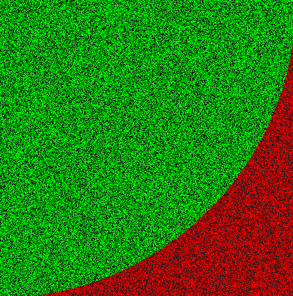

# Monte Carlo Pi Approximation

A simple Monte Carlo simulation using Python and Pygame to approximate the value of Pi by randomly sampling points within a square and checking if they fall within a quarter circle.

## Features

- **Random Sampling**: Points are randomly generated inside a square to estimate Pi.
- **Visual Representation**: Green points fall inside the quarter circle, red points fall outside.
- **Live Calculation**: Displays the current approximation of Pi in the console.
- **Efficient Algorithm**: Uses the Monte Carlo method to refine the Pi estimate over time.

## Requirements

- **Python 3.x**
- **Pygame**: Install it via pip with `pip install pygame`

## Project Structure

- **`main.py`**: The main script running the Monte Carlo Pi approximation.
- **Monte Carlo Method**: Randomly places points and calculates Pi based on the ratio of points inside the circle.
- **Visualization**: Displays red and green points in real-time, representing the calculation process.

## Customization

You can modify the simulation parameters within the script:

- **Resolution** (`resolution`)
- **Number of Points** (indirectly controlled by loop iterations)
- **Update Rate** (frequency of Pi calculation output)

## Simulation Details

- **The Method**: Random points are plotted within a square of side length 1.
- **Circle Check**: If a point’s coordinates `(x, y)` satisfy `x² + y² < 1`, it falls inside the quarter-circle.
- **Pi Approximation**: The ratio of points inside the circle to total points approximates `π/4`, and Pi is calculated as `4 * (inside points / total points)`.

## License

This project is licensed under the Mozilla Public License 2.0 (MPL-2.0).

### Additional Note on Commercial Use
**Commercial use of this software or any derived works is prohibited without prior written permission from the original author.** For commercial licensing inquiries, please contact loan.tremoulet.breton@gmail.com.

